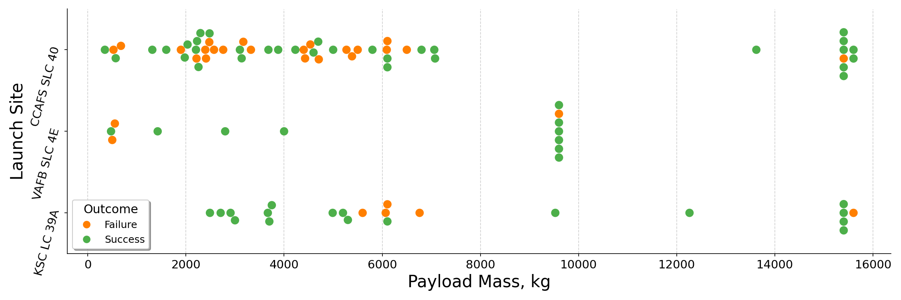

# Applied Data Science Capstone

This Capstone marks the culmination of the [IBM Data Science Professional Certificate](https://www.coursera.org/professional-certificates/ibm-data-science) specialization, serving as the 10th and final course. It consolidates the knowledge gained throughout the entire program into a comprehensive project.

## Project Background

SpaceX, a pioneering company in the commercial space age, has revolutionized space travel by making it more affordable. The Falcon 9 rocket launches, advertised on the company's website, boast a cost of 62 million dollars, significantly undercutting other providers. A key contributor to these savings is SpaceX's ability to reuse the first stage. This project aims to predict whether SpaceX will reuse the first stage based on public information and machine learning models.

## Questions to be Answered

1. How do variables such as payload mass, launch site, number of flights, and orbits impact the success of the first stage landing?
2. Does the rate of successful landings increase over the years?
3. What is the optimal algorithm for binary classification in this case?

## Methodology

### 1. Data Collection Methodology

- Utilized SpaceX REST API
- Employed Web Scraping from Wikipedia

### 2. Data Wrangling

- Filtered the data
- Addressed missing values
- Applied One Hot Encoding to prepare the data for binary classification

### 3. Exploratory Data Analysis (EDA)

- Conducted EDA using visualization and SQL

### 4. Interactive Visual Analytics

- Utilized Folium and Plotly Dash for dynamic visualizations
    #### SpaceX Launch Records Dashboard

  This interactive dashboard is developed using Dash, a Python framework for building analytical web applications. It allows you to explore and visualize SpaceX launch records based on various parameters.
  
  #### Requirements
  
  Make sure you have the required libraries installed. You can install them using the following:
  
  ```bash
  pip install pandas dash plotly colorcet
  ```
  Then:
  ```bash
  python dash_app.py
  ```
  #### Accessing the Dashboard
  After running the script, the app will start, and you should see output indicating that the server is running. Typically, it will be accessible at [http://127.0.0.1:8050/](http://127.0.0.1:8050/) or a similar address.
  
  #### Interacting with the Dashboard
  * Use the dropdown menu to select a launch site.
  * Explore the pie chart showing total successful launches or the success vs. failure breakdown for a specific site.
  * Adjust the payload range using the slider.
  * View the scatter chart illustrating the correlation between payload and launch success.
    

### 5. Predictive Analysis using Classification Models

- Developed, tuned, and evaluated classification models for optimal results

## Visualization Samples




